<a id="article_top"></a>

# Agenda

* IDE 開發工具的安裝&介紹
  * CS+ , e² studio , CCRH , CCRL , Smart Configurator , Renesas Flash programmer
* Smart Configurator
  * [Clock tree , Pin configuration , Peripheral configuration](#article_clock)
  * [Timer](#article_timer)
  * [GPIO](#article_gpio)
  * [external pin interrupt](#article_ext)
  * [I2C](#article_i2c)
  * [SPI](#article_spi)
  * [UART](#article_uart)
  * [PWM](#article_pwm)
  * [ADC](#article_adc)
* CS+
  * Code Compiler & programming flow ( from C code to IC ).
* Tips

---

# IDE & Debug tool

[Debug & programmer - E2 emulator](https://www.renesas.com/us/en/software-tool/e2-emulator-rte0t00020kce00000r)


[Debug & programmer - E2 emulator lite for RL78](https://www.renesas.com/us/en/software-tool/e2-emulator-lite-rte0t0002lkce00000r)


[IDE – CS+ , suggest for automotive product](https://www.renesas.com/en/software-tool/cs)


[IDE – e² studio](https://www.renesas.com/en/software-tool/e-studio)


---

# User manual : CS+


[CS+ User’s Manual](https://www.renesas.com/en/software-tool/cs)


<u>Integrated Development Environment User's Manual: RH850 Debug Tool</u>
[back to top](#article_top)

---

# User manual : e² studio


[e² studio User’s Manual](https://www.renesas.com/en/software-tool/e-studio)


---

# Compiler : CC-RH for RH850
 

[Compiler – C Compiler Package for RH850 Family [CC-RH] ](https://www.renesas.com/en/software-tool/c-compiler-package-rh850-family)

***Base on selected IDE , install the related compiler ( RH850 Compiler CC-RH for CS+ or for e² studio)**


[Compiler Licenses](https://www.renesas.com/en/software-tool/compiler-licenses)


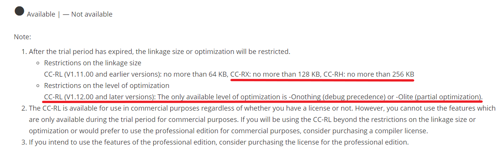


---

# User manual : CC-RH for RH850


[Compiler CC-RH User’s Manual](https://www.renesas.com/en/software-tool/c-compiler-package-rh850-family)


---

# Smart Configurator main window

[IDE plug in  – Smart Configurator](https://www.renesas.com/en/software-tool/smart-configurator)

***Base on selected IDE , install the related Smart Configurator**

[https://www.renesas.com/en/software-tool/rh850-smart-configurator](https://www.renesas.com/en/software-tool/rh850-smart-configurator)


---

# Renesas Flash Programmer


[Renesas Flash Programmer (Programming GUI)](https://www.renesas.com/en/software-tool/renesas-flash-programmer-programming-gui)


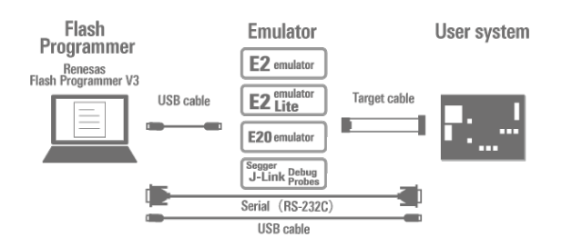

---

# Create project by CS+ (RH850)


<u>Integrated Development Environment User's Manual: Project Operation</u>
[back to top](#article_top)

---

# CS+ (RH850) : main window


---

# CS+ (RH850) : open smart configurator

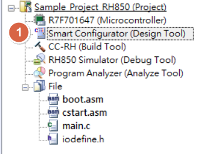

<span style="color:#FF0000">
Open smart configurator from IDE (CS+)<br><br> 
</span>


<u>RH850 Smart Configurator User's Guide: CS+</u>
<u>Smart Configurator User's Manual: RH850 API Reference</u>
<u>Smart Configurator Guide on Sample Projects for RH850/F1KM Devices</u>
[back to top](#article_top)

---

# CS+ (RH850) – CC-RH options

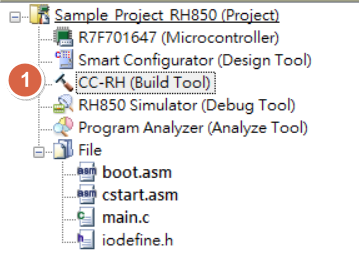

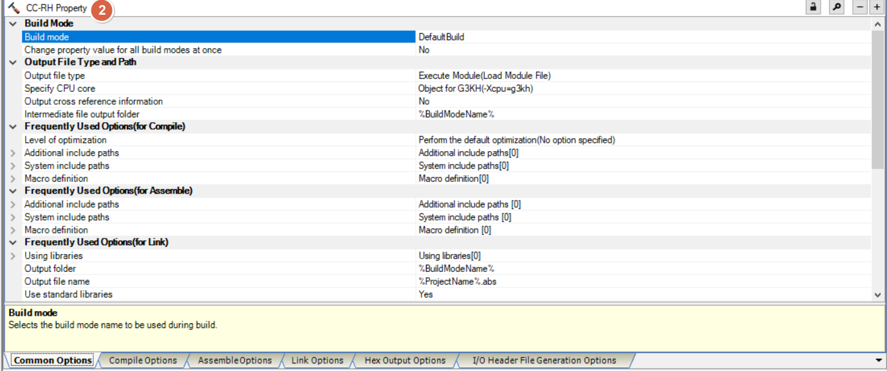

<u>Integrated Development Environment User's Manual: RH850 Debug Tool</u>
[back to top](#article_top)

---

# CS+ (RH850) – Debug Tool options

<span style="color:#FF0000">
Select Debug Tool<br><br>
</span>

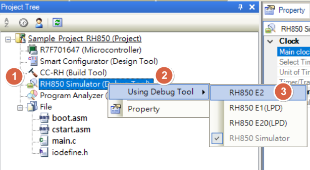


<u>Integrated Development Environment User's Manual: RH850 Debug Tool</u>
[back to top](#article_top)

---

# Smart Config. : main window (RH850)


<u>RH850 Smart Configurator User's Guide: CS+</u>
[back to top](#article_top) 

---

<a id="article_clock"></a>

# Smart Config. - Clock

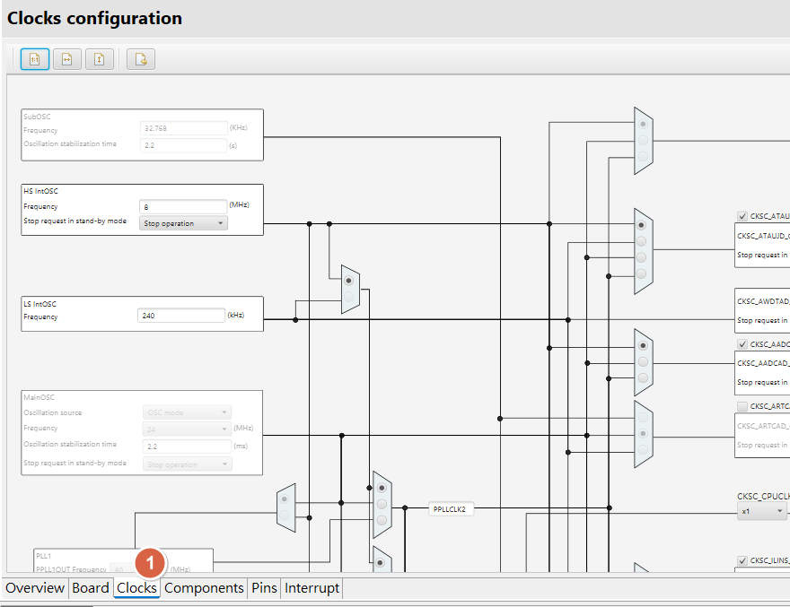


<span style="color:#FF0000">
Select clock for PLL0 , PLL1<br><br> 
</span>


<u>RH850 Smart Configurator User's Guide: CS+</u>
[back to top](#article_top)    

---


<span style="color:#FF0000">
use MainOSC (external osc) will enable X1 , X2 pin<br><br>
</span> 


<u>RH850 Smart Configurator User's Guide: CS+</u>
[back to top](#article_top)    

---

# Smart Config. : add component


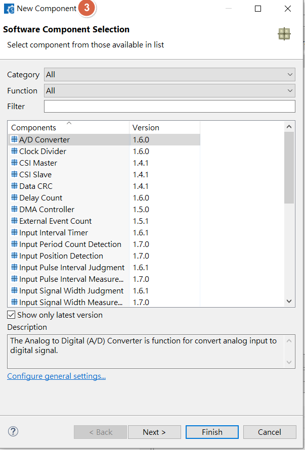

<u>RH850 Smart Configurator User's Guide: CS+</u>
[back to top](#article_top)    

---

<a id="article_timer"></a>

# Smart Config. – Interval Timer


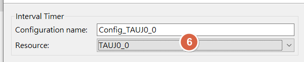

<u>RH850 Smart Configurator User's Guide: CS+</u>
[back to top](#article_top)    

---

<span style="color:#FF0000">
TAUxx timer difference<br><br>
</span>


<span style="color:#FF0000">
TAUxx timer clock source<br><br>
</span>


<u>RH850 Smart Configurator User's Guide: CS+</u>
[back to top](#article_top)    

---


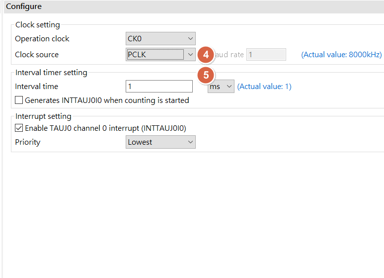

<u>RH850 Smart Configurator User's Guide: CS+</u>
[back to top](#article_top)    

---

<span style="color:#FF0000">
Press <b>[Generate Code]</b> in Smart config. will automatically generate driver source code under CS+ project<br><br>
</span> 


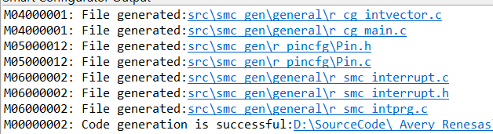


<u>RH850 Smart Configurator User's Guide: CS+</u>
[back to top](#article_top)    

---

<span style="color:#FF0000">
Re-build project , will see the build result is complete without error<br><br>
</span>

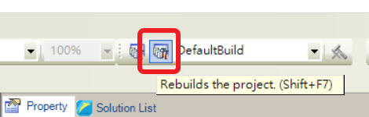

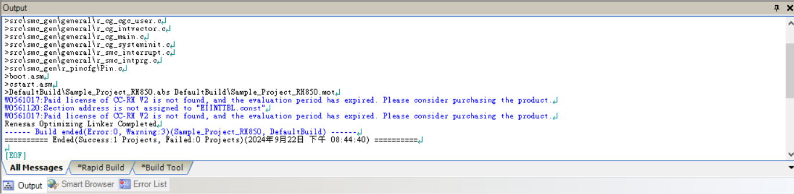


<span style="color:#FF0000">
This will be project main code : <br>
<b>r_cg_main.c</b><br><br>
</span>


<u>RH850 Smart Configurator User's Guide: CS+</u>
[back to top](#article_top)    

---

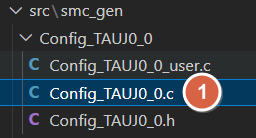


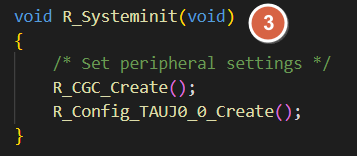

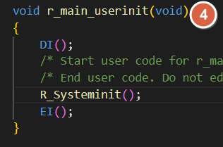


<span style="color:#FF0000">
Need to manual add driver start API , ex : <br><br>
</span>

```
R_Config_TAUJ0_0_Start(); 
```


<u>RH850 Smart Configurator User's Guide: CS+</u>
[back to top](#article_top)    

---

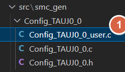


<span style="color:#FF0000">
Add TIMER interrupt function under <br><br>
</span>  

```
r_Config_TAUJ0_0_interrupt()
```

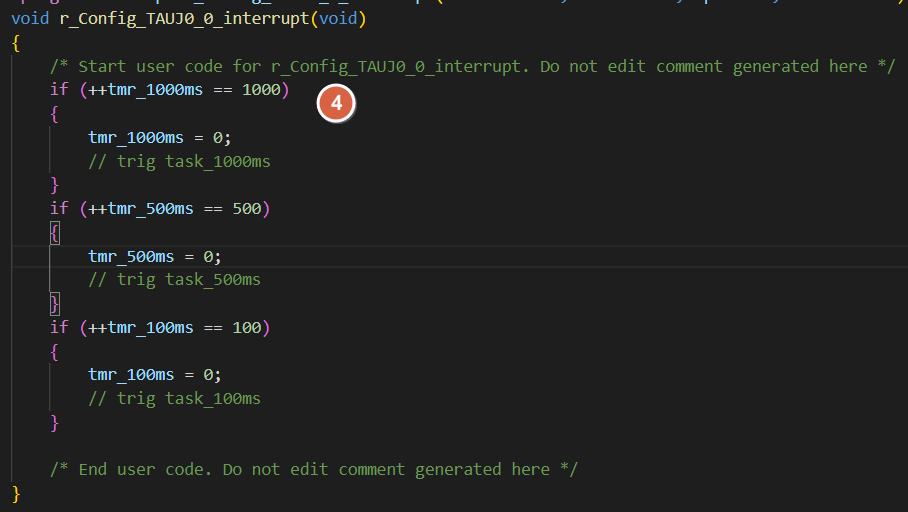


<u>RH850 Smart Configurator User's Guide: CS+</u>
[back to top](#article_top)    

---

# Smart Config. : Timer delay


<u>RH850 Smart Configurator User's Guide: CS+</u>
[back to top](#article_top)    

---

# Smart Config. – Generate code

<span style="color:#FF0000">
[Generate Code] in Smart configurator , will re-generate driver code <b><u>every time</b></u><br><br>
</span> 


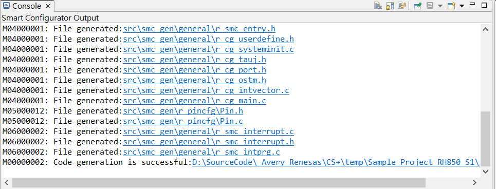


<u>RH850 Smart Configurator User's Guide: CS+</u>
[back to top](#article_top)    

---

# CS+ - driver code

<span style="color:#FF0000">
Put custom application code , variable , declaration , between these 2 comment , will merge into driver code when execute [Generate Code] in Smart config<br><br>
</span>  


<u>RH850 Smart Configurator User's Guide: CS+</u>
[back to top](#article_top)    

---

<a id="article_gpio"></a>

# Smart Config. – GPIO


<u>RH850 Smart Configurator User's Guide: CS+</u>
[back to top](#article_top)    

---

<span style="color:#FF0000">
Select target GPIO port , to set GPIO input , output<br><br>
</span>>

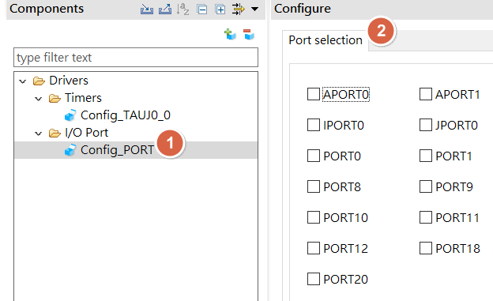


<u>RH850 Smart Configurator User's Guide: CS+</u>
[back to top](#article_top)    

---

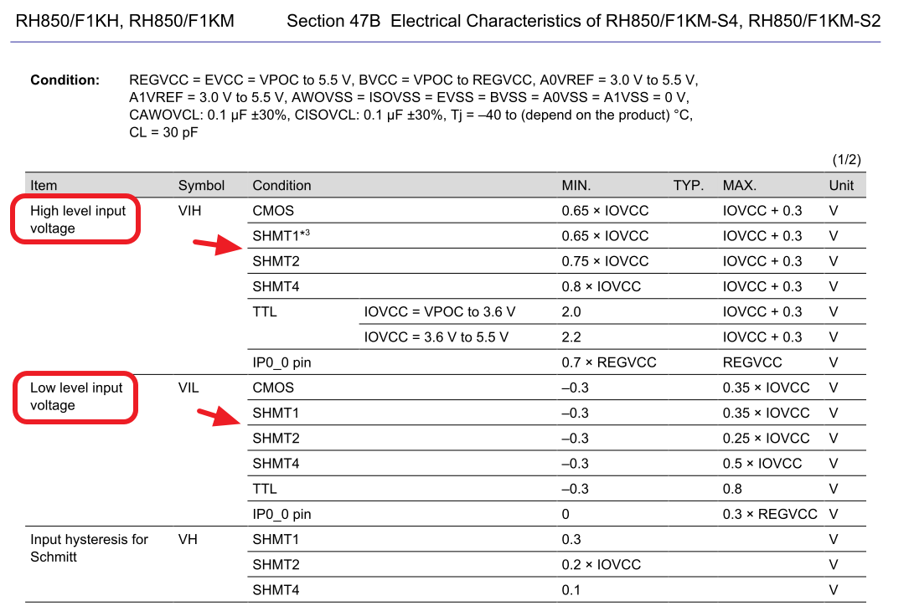

<u>RH850 Smart Configurator User's Guide: CS+</u>
[back to top](#article_top)    

---

# Smart Config. – GPIO output

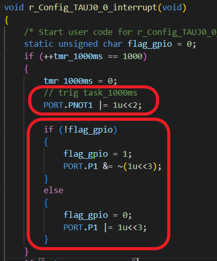


<u>RH850 Smart Configurator User's Guide: CS+</u>
[back to top](#article_top)    

---

# Smart Config. – GPIO input

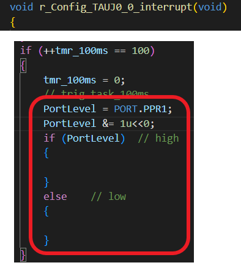


<u>RH850 Smart Configurator User's Guide: CS+</u>
[back to top](#article_top)    

---

# RH850 F1KM-S4 example code

Y-ASK-RH850F1KM-S4-V3

[https://www.renesas.com/en/products/microcontrollers-microprocessors/rh850-automotive-mcus/y-ask-rh850f1km-s4-v3-rh850f1km-s4-and-rh850f1km-s2-starter-kit](https://www.renesas.com/en/products/microcontrollers-microprocessors/rh850-automotive-mcus/y-ask-rh850f1km-s4-v3-rh850f1km-s4-and-rh850f1km-s2-starter-kit)

Y-ASK-RH850F1KM-S4-V3 Software Package

[https://www.renesas.com/document/sws/y-ask-rh850f1km-s4-v3-software-package?language=en&r=1261056](https://www.renesas.com/document/sws/y-ask-rh850f1km-s4-v3-software-package?language=en&r=1261056)


<u>RH850 Smart Configurator User's Guide: CS+</u>
[back to top](#article_top)    

---

<a id="article_ext"></a>

# Smart Config. – external int.

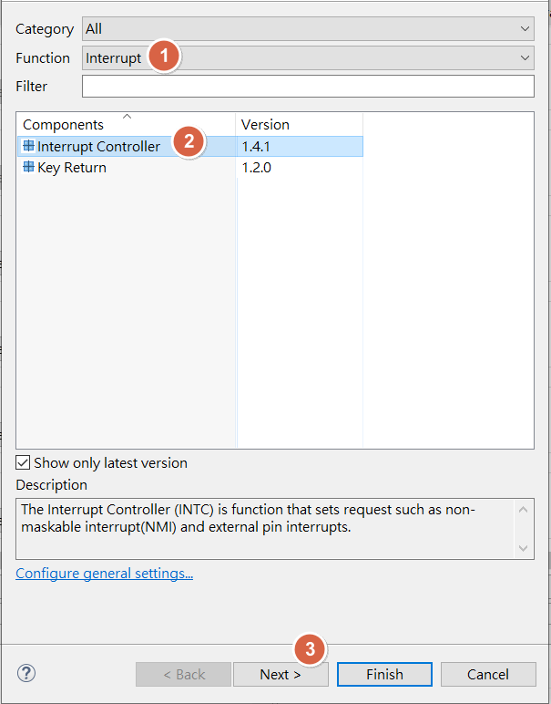


<u>RH850 Smart Configurator User's Guide: CS+</u>
[back to top](#article_top)    

---

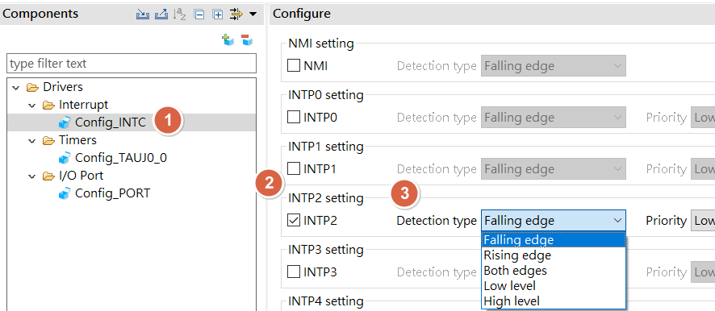

<u>RH850 Smart Configurator User's Guide: CS+</u>
[back to top](#article_top)    

---


<span style="color:#FF0000">
Add code when trigger external interrupt INTP2<br><br>
</span>

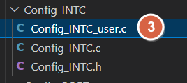

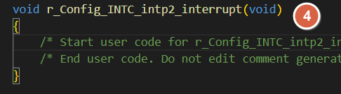

<span style="color:#FF0000">
Need to manual add driver start API , ex : <br><br>
</span>

```
R_Config_INTC_INTP2_Start();
```


<u>RH850 Smart Configurator User's Guide: CS+</u>
[back to top](#article_top)    

---

<a id="article_i2c"></a>

# Smart Config. – I2C

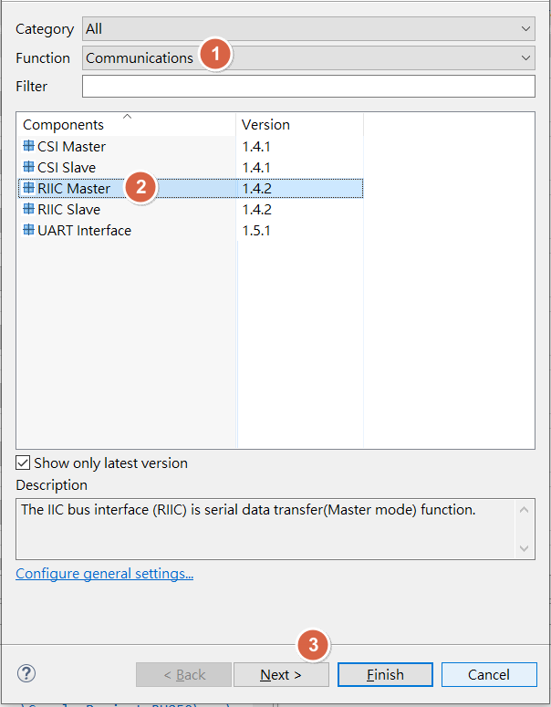

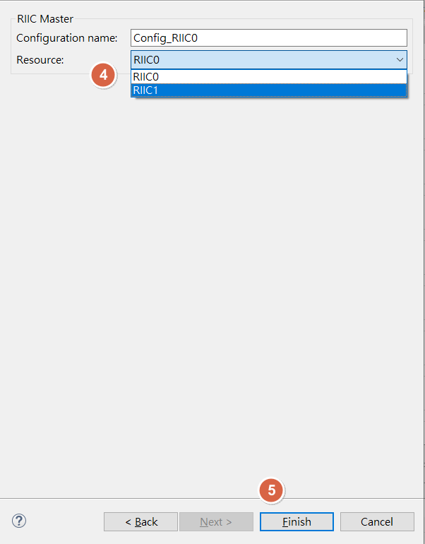

<u>RH850 Smart Configurator User's Guide: CS+</u>
[back to top](#article_top)    

---

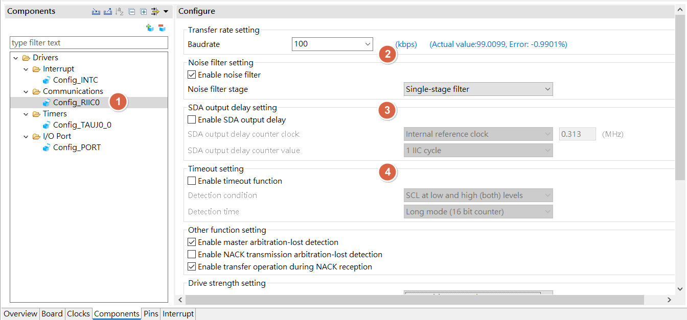

<u>RH850 Smart Configurator User's Guide: CS+</u>
[back to top](#article_top)    

---


<u>RH850 Smart Configurator User's Guide: CS+</u>
[back to top](#article_top)    

---


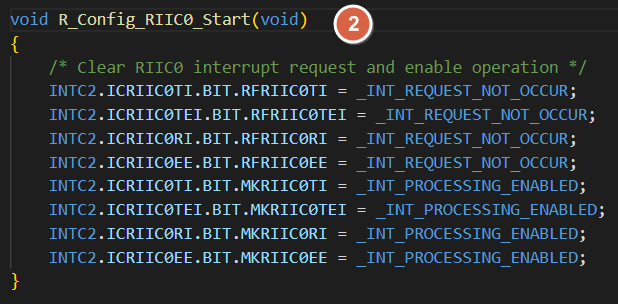


<span style="color:#FF0000">
Need to manual add driver start API , ex : <br><br>
</span>

```
R_Config_RIIC0_Start();
```


<u>RH850 Smart Configurator User's Guide: CS+</u>
[back to top](#article_top)    

---

<a id="article_spi"></a>


# Smart Config. – SPI (CSIG0)


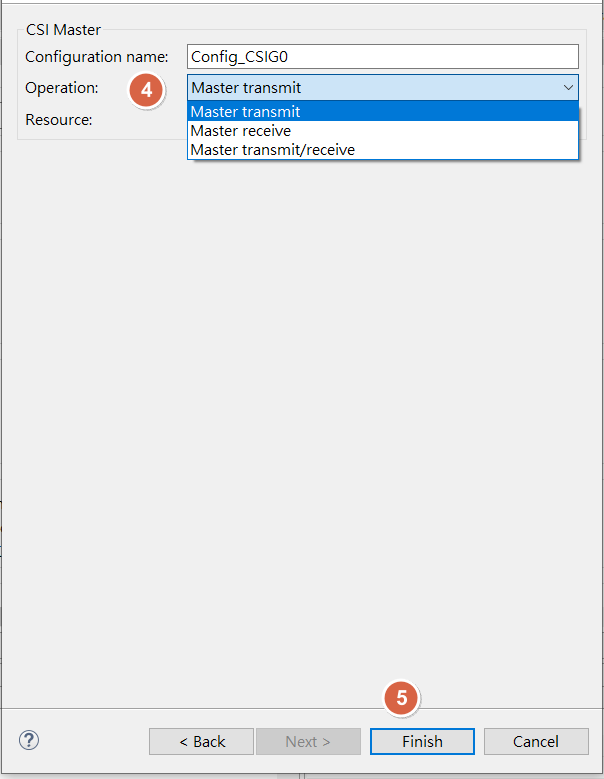

<u>RH850 Smart Configurator User's Guide: CS+</u>
[back to top](#article_top)    

---


<u>RH850 Smart Configurator User's Guide: CS+</u>
[back to top](#article_top)    

---

# Smart Config. – CPOL/CPHA

* CPOL :
  * 0 : clock idle at LOW
  * 1 : clock idle at HIGH
* CPHA :
  * 0 : 1^st^ EDGE
  * 1 : 2^ND^ EDGE

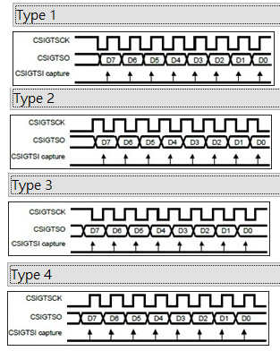

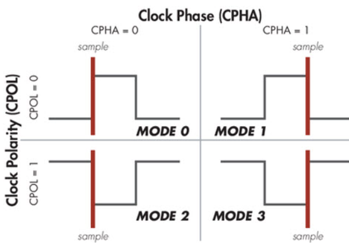


| CPOL | CPHA | mode | Type |
|:--:|:--:|:--:|:--:|
| 1  | 1 | 3 | 1 |
| 0  | 1 | 1 | 2 |
| 1  | 0 | 2 | 3 |
| 0  | 0 | 0 | 4 |


<u>RH850 Smart Configurator User's Guide: CS+</u>
[back to top](#article_top)    

---

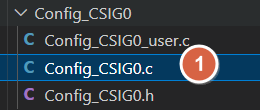

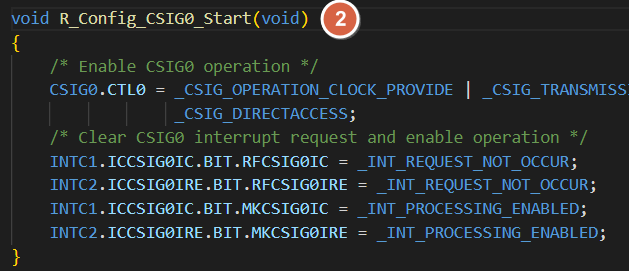


<span style="color:#FF0000">
Need to manual add driver start API , ex : <br><br>
</span>

```
R_Config_CSIG0_Start();
```

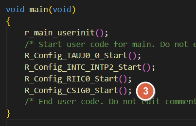

<u>RH850 Smart Configurator User's Guide: CS+</u>
[back to top](#article_top)    

---

# Smart Config. – SPI (CSIH0)


<u>RH850 Smart Configurator User's Guide: CS+</u>
[back to top](#article_top)    

---

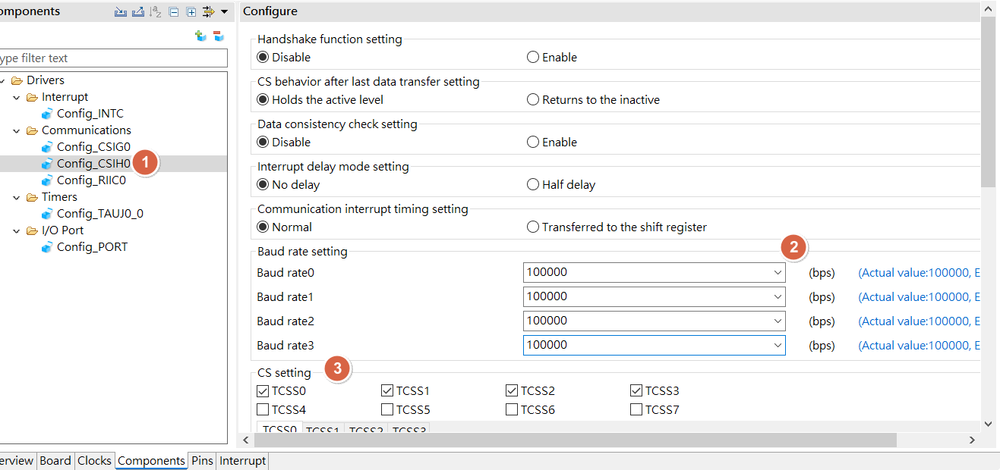

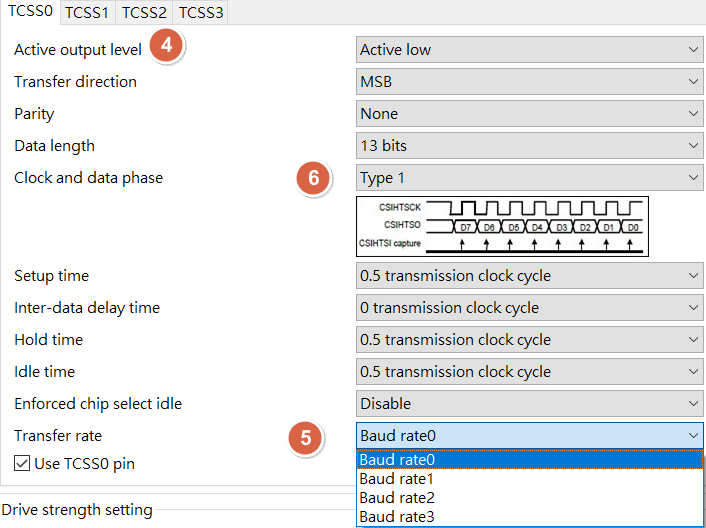

<u>RH850 Smart Configurator User's Guide: CS+</u>
[back to top](#article_top)    

---

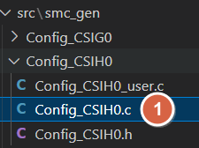


<span style="color:#FF0000">
Need to manual add driver start API , ex : <br><br>
</span>

```
R_Config_CSIH0_Start();
```

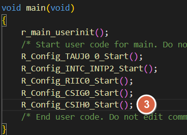

<u>RH850 Smart Configurator User's Guide: CS+</u>
[back to top](#article_top)    

---

# Smart Config. – CSIG vs CSIH

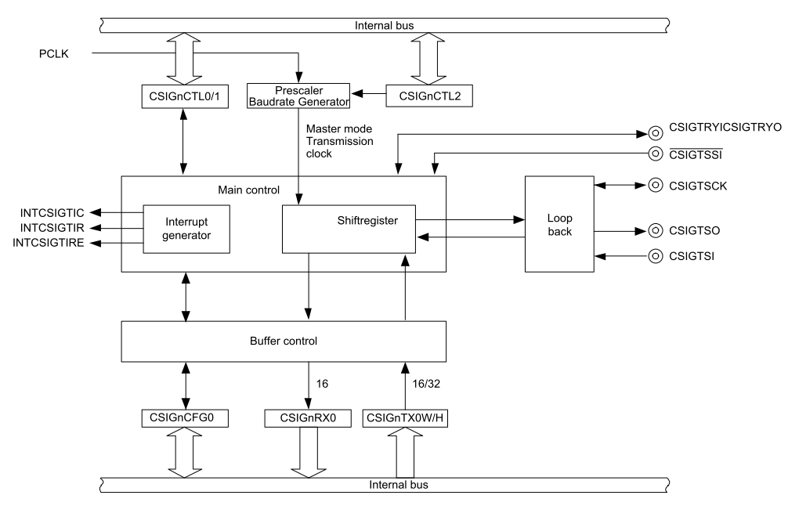


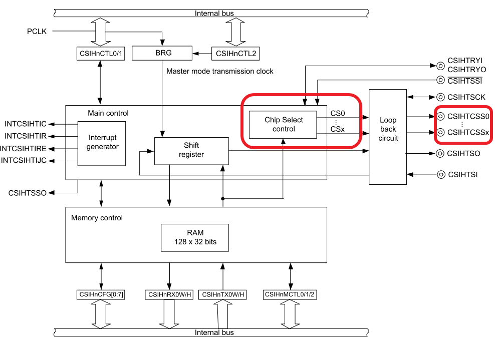

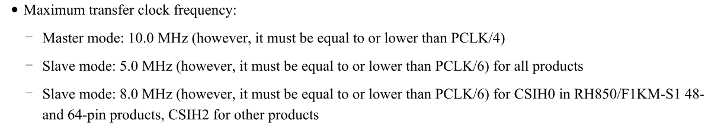

<u>RH850 Smart Configurator User's Guide: CS+</u>
[back to top](#article_top)    

---

<a id="article_uart"></a>

# Smart Config. – UART0

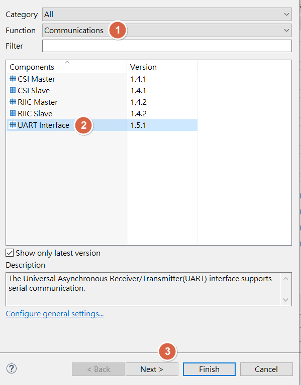


<u>RH850 Smart Configurator User's Guide: CS+</u>
[back to top](#article_top)    

---


<u>RH850 Smart Configurator User's Guide: CS+</u>
[back to top](#article_top)    

---


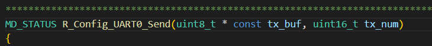


<span style="color:#FF0000">
Need to manual add driver start API , ex : <br><br>
</span>

```
R_Config_UART0_Start();
```


<u>RH850 Smart Configurator User's Guide: CS+</u>
[back to top](#article_top)    

---

<a id="article_pwm"></a>

# Smart Config. – PWM

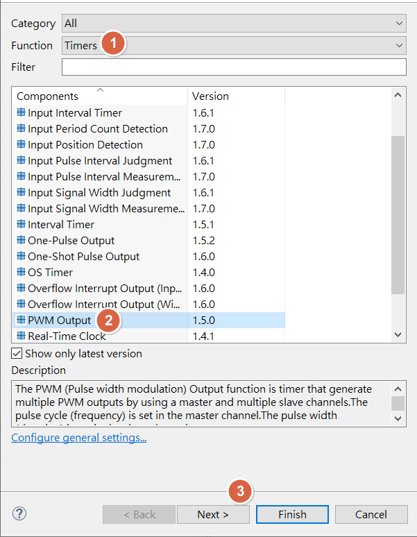

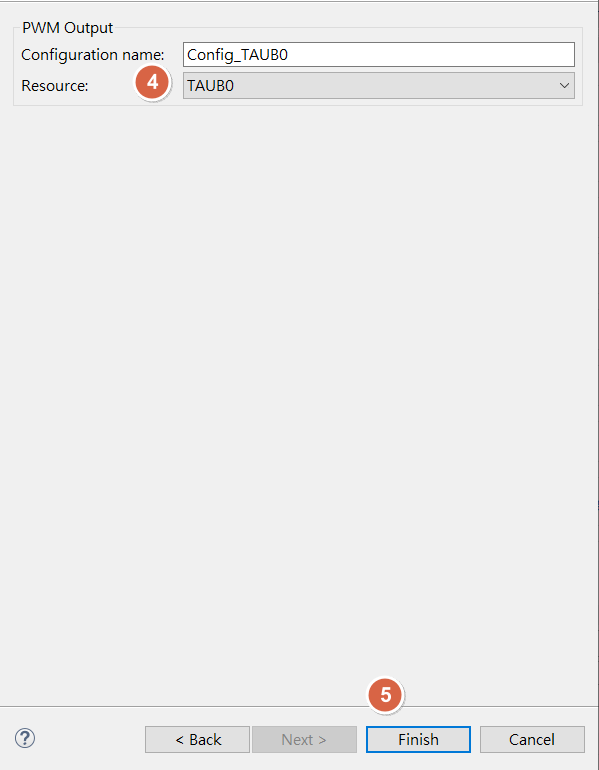

<u>RH850 Smart Configurator User's Guide: CS+</u>
[back to top](#article_top)    

---

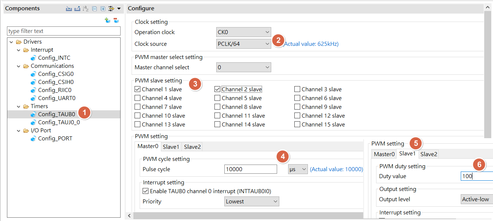


<u>RH850 Smart Configurator User's Guide: CS+</u>
[back to top](#article_top)    

---


<u>RH850 Smart Configurator User's Guide: CS+</u>
[back to top](#article_top)    

---

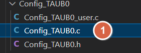


PWM duty adjust example

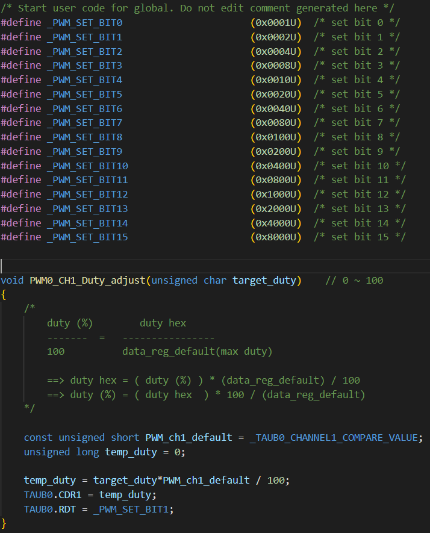


<span style="color:#FF0000">
Need to manual add driver start API , ex : <br><br>
</span>

```
R_Config_TAUB0_Start();
```


<u>RH850 Smart Configurator User's Guide: CS+</u>
[back to top](#article_top)    

---

<a id="article_adc"></a>

# Smart Config. – ADC


<u>RH850 Smart Configurator User's Guide: CS+</u>
[back to top](#article_top)    

---


<u>RH850 Smart Configurator User's Guide: CS+</u>
[back to top](#article_top)    

---

# Smart Config. – ADC sampling

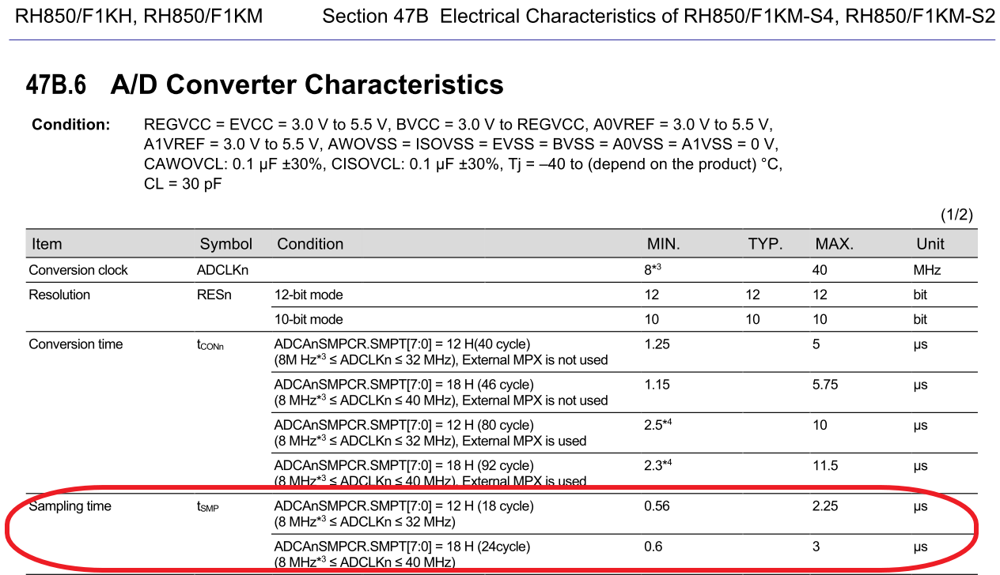


<u>RH850 Smart Configurator User's Guide: CS+</u>
[back to top](#article_top)    

---

# Smart Config. – ADC

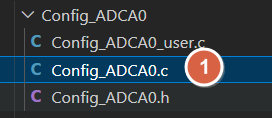

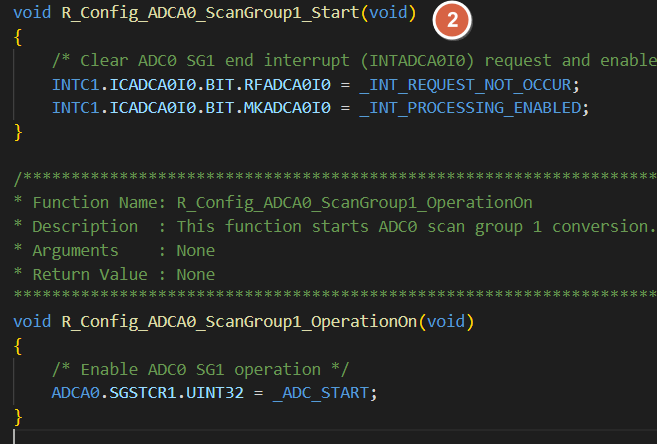


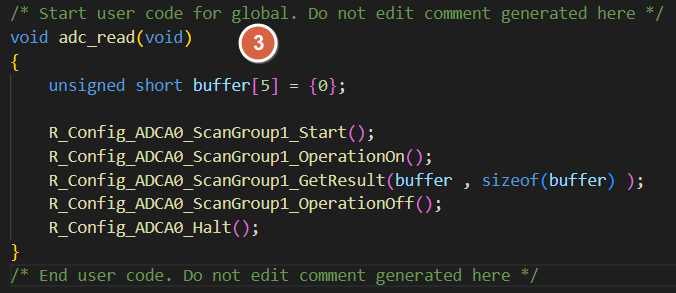


<span style="color:#FF0000">
Need to manual add driver start API , ex : <br><br>
</span>

```
R_Config_ADCA0_ScanGroup1_Start();
```


<u>RH850 Smart Configurator User's Guide: CS+</u>
[back to top](#article_top)    

---

# Add root path in Path Edit


<span style="color:#FF0000">
After generate driver code , compile project under CS+ , if meet compile error (not open iodefine.h) , save and close CS+ project and re-open<br><br>
</span>


<span style="color:#FF0000">
Check CC-RH (Build Tool) > Common Options > Additional include paths , make sure already include the new add driver path (ex : TAUJ0_0 )<br><br>
</span>


<span style="color:#FF0000">
add root path under project to fix compile error issue<br><br>
</span>

```
.\
.
```


<u>RH850 Smart Configurator User's Guide: CS+</u>
[back to top](#article_top)    

---

# Add main loop

<span style="color:#FF0000">
Need to manual add main loop , ex : <br><br>
</span>

```
while(1)
{
}
```


<u>RH850 Smart Configurator User's Guide: CS+</u>
[back to top](#article_top)    

---

<span style="color:#FF0000">
If not add while loop under main code , program will <b>stop</b> at exit in csstart.asm<br><br>
</span> 

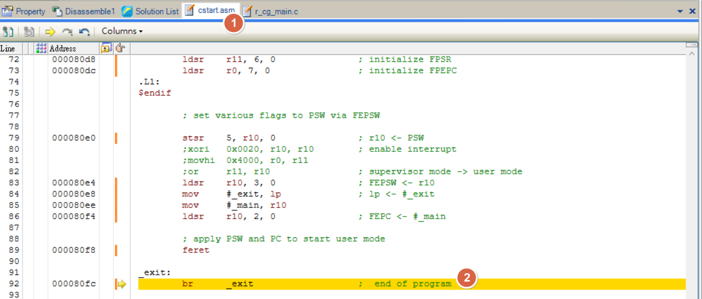


<u>RH850 Smart Configurator User's Guide: CS+</u>
[back to top](#article_top)    

---

# To fix INTERRUPT NOT WORK ISSUE

<span style="color:#FF0000">
Remove [ ; ] , to enable table reference method<br><br>
</span>

```
USE_TABLE_REFERENCE_METHOD .set 1
```

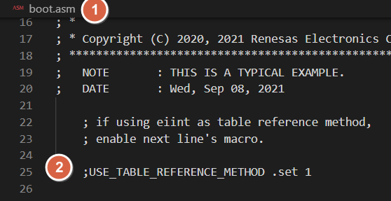


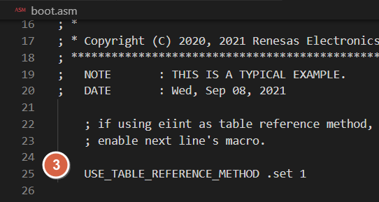

<u>RH850 Smart Configurator User's Guide: CS+</u>
[back to top](#article_top)    

---

<span style="color:#FF0000">
Add [ ; ] , to disable default interrupt<br><br> 
</span>

```
;.section "EIINTTBL", const
;.align 512
;.dw #_Dummy_EI ; INT0
;.dw #_Dummy_EI ; INT1
;.dw #_Dummy_EI ; INT2
;.rept 512 - 3
;.dw #_Dummy_EI ; INTn
;.endm
```

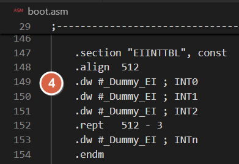


<u>RH850 Smart Configurator User's Guide: CS+</u>
[back to top](#article_top)    

---


<span style="color:#FF0000">
Add [ .const ]<br><br>   
</span>

```
mov #__sEIINTTBL.const , r6 
```


<u>RH850 Smart Configurator User's Guide: CS+</u>
[back to top](#article_top)    

---

<span style="color:#FF0000">
Open [<b>Section</b>] modify under [<b>Link Options</b>] in [<b>CC-RH Property</b>]<br><br>
</span>


<u>RH850 Smart Configurator User's Guide: CS+</u>
[back to top](#article_top)    

---

<span style="color:#FF0000">
REMOVE [<b>EIINTTBL</b>] in Section Settings
1. Select [on Section : EIINTTBL]
2. Select [Remove]
</span>

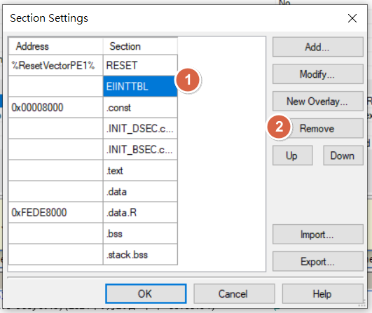


<span style="color:#FF0000">
ADD [address 0x200] in Section Settings
1. Select on [blank in Address]
2. Select [Add]
3. Key in [200]<br><br>
</span>


<span style="color:#FF0000">
ADD [<b>EIINTTBL.const</b>] in Section Settings
1. Select on [blank in Section] (addr : 0x200) 
2. Select [Add]
3. Key in [EIINTTBL.const]<br><br>
</span>

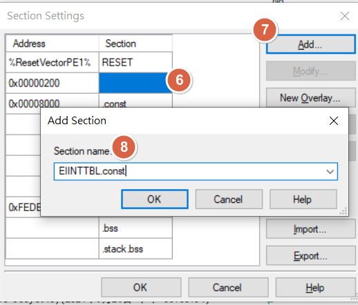


<span style="color:#FF0000">
Final section table result<br><br>
</span>

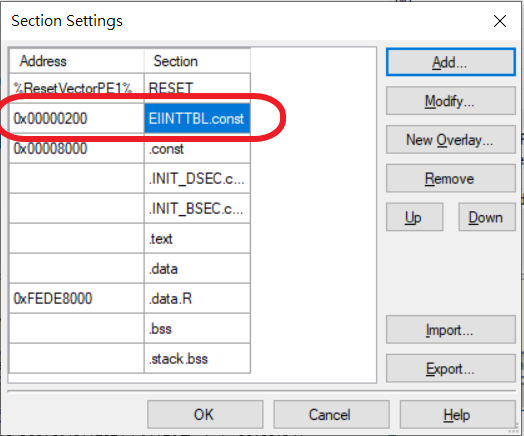

<u>RH850 Smart Configurator User's Guide: CS+</u>
[back to top](#article_top)    

---

# CS+ - entry debug mode


<span style="color:#FF0000">
Make sure <u><b>[DISCONNECT]</b></u> CS+ project before REMOVE DEBUGGER tool <br><br>
</span> 


download program after rebuild
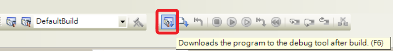


debug function


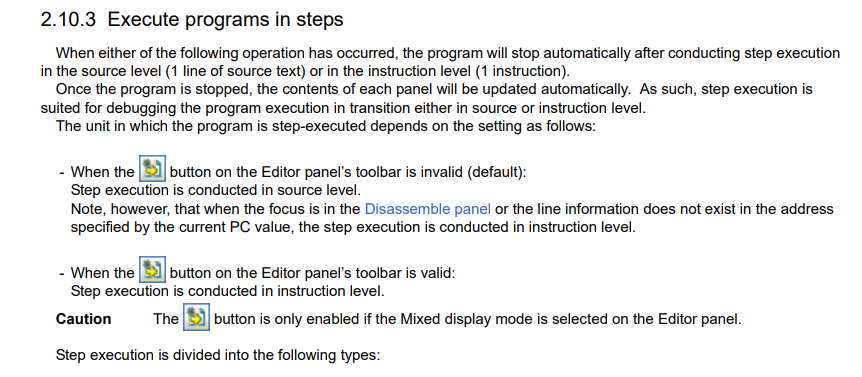


<u>Integrated Development Environment User's Manual: RH850 Debug Tool</u>
[back to top](#article_top)    

---

# Renesas Flash Programmer


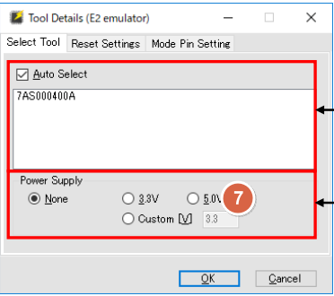


<u>Renesas Flash Programmer V*.** Flash memory programming softwareUser's Manual </u>
[back to top](#article_top)   

---

<a id="article_tips"></a>

# Tips : Convert to Hex


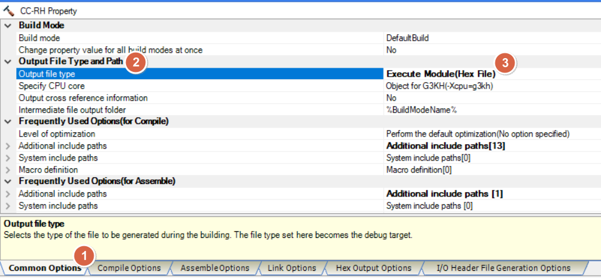

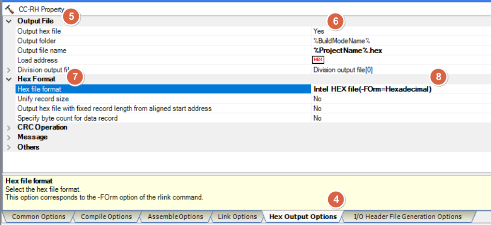


---

# Tips : Emulator power on MCU

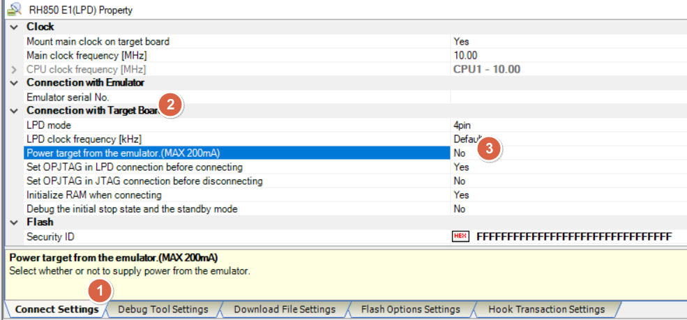


---

# Tips : Set CLOCK (F1KM-S1)

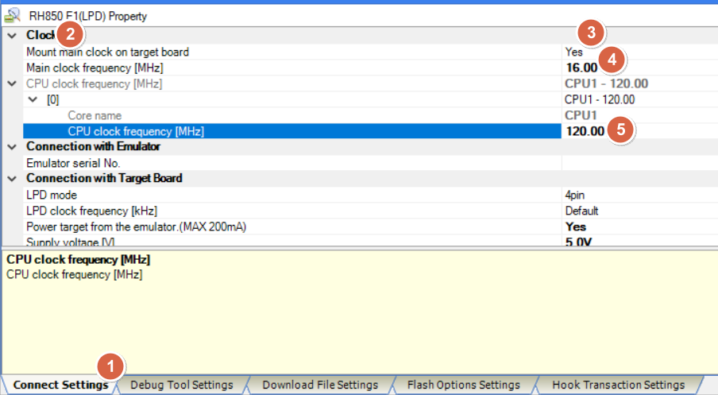


---

# Tips : map file display


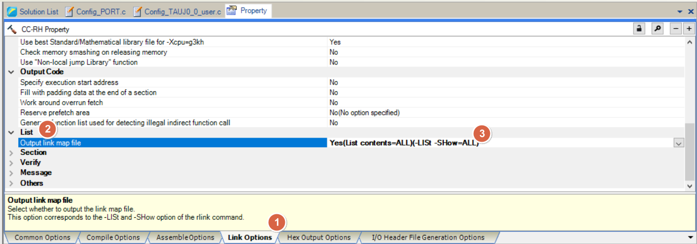

<span style="color:#FF0000">
Function address<br>
size display<br>
location assignment<br>
Code size <br>
RAM size display<br><br>
</span>

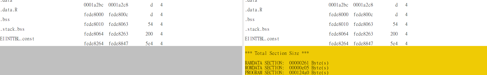


---

# Tips : section message display

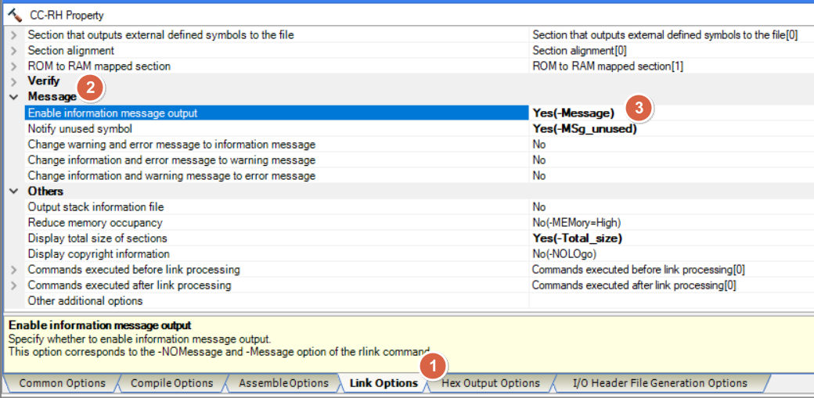

Display section message


---

# Tips : size display display in output window


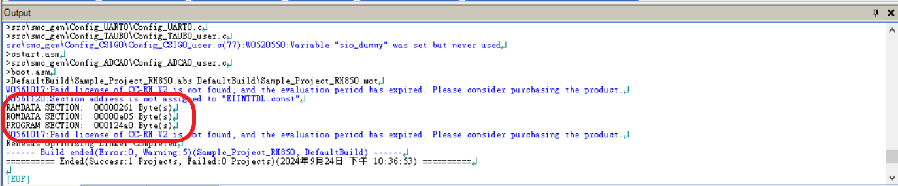


---

# Tips : Backup times (generate code)


---

# Tips : section define modify


<u>CC-RH Compiler User's Manual</u>
[back to top](#article_top)    

---

# Tips : section define (const)


<span style="color:#FF0000">
ADD [<b>privateData.const</b>] in Section Settings<br>
1. Select on [.data] in Section<br>
2. Select [Add]<br>
3. Key in [<b>privateData.const</b>] <br><br>
</span>  


| item | note |
|:--:|:--:|
| data  | variables with initial value  |
| bss  | variables with no initial value  |
| text  | program code  |
|<span style="color:#FF0000"><b>const</b></span>   | <span style="color:#FF0000"><b>constant data</b></span>  |


Code assignment example


<u>CC-RH Compiler User's Manual</u>
[back to top](#article_top)    

---

# Tips : section define (data)

<span style="color:#FF0000">
ADD [<b>privateData.data</b>] in Section Settings<br>
1. Select on [.data] in Section<br>
2. Select [Add]<br>
3. Key in [<b>privateData.data</b>] <br><br>
</span>


| item | note |
|:--:|:--:|
| <span style="color:#FF0000"><b>data</b></span>  | <span style="color:#FF0000"><b>variables with initial value</b></span>  |
| bss  | variables with no initial value  |
| text  | program code  |
|const   | constant data  |


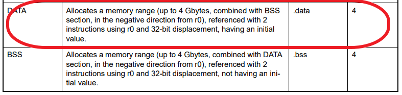

Code assignment example


<u>CC-RH Compiler User's Manual</u>
[back to top](#article_top)    

---

# Tips : section define (bss)

<span style="color:#FF0000">
ADD [<b>privateData.bss</b>] in Section Settings<br>
1. Select on [.bss] in Section<br>
2. Select [Add]<br>
3. Key in [<b>privateData.bss</b>] <br><br>
</span>


| item | note |
|:--:|:--:|
| data  | variables with initial value  |
| <span style="color:#FF0000"><b>bss</b></span>  | <span style="color:#FF0000"><b>variables with no initial value</b></span>  |
| text  | program code  |
|const   | constant data  |


Code assignment example


<u>CC-RH Compiler User's Manual</u>
[back to top](#article_top)    

---

# Tips : section define (not assigned address)

<span style="color:#FF0000">
New add custom define section as below <br>
Also able to define the address base on application<br><br>
</span>


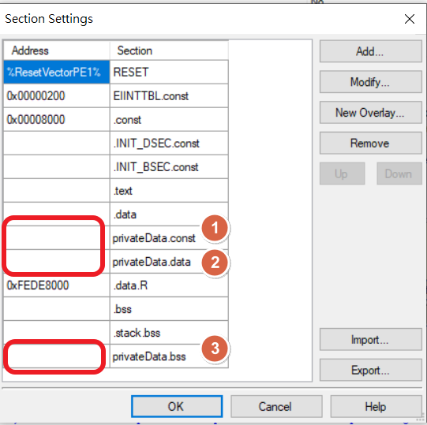

Code assignment example


check the address in map file


<u>CC-RH Compiler User's Manual</u>
[back to top](#article_top)    

---

# Tips : section define (assigned address)

<span style="color:#FF0000">
New add custom define section as the capture<br>
Also able to define the address base on application<br><br>
</span>

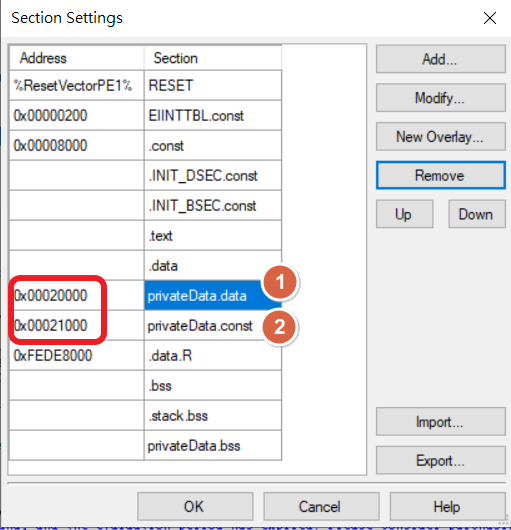

Code assignment example


check the address in map file


<u>CC-RH Compiler User's Manual</u>
[back to top](#article_top)    

---

# Tips : section allocation , size


CC\-RH Compiler User's Manual

# Tips : project split


<span style="color:#FF0000">
Use [<b> Build Mode Setting </b>] , to split different macro in different project setting if necessary<br><br>
</span>


Project split example , modify the projec name
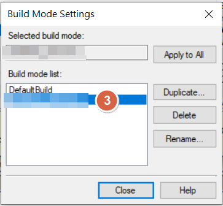

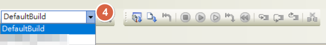

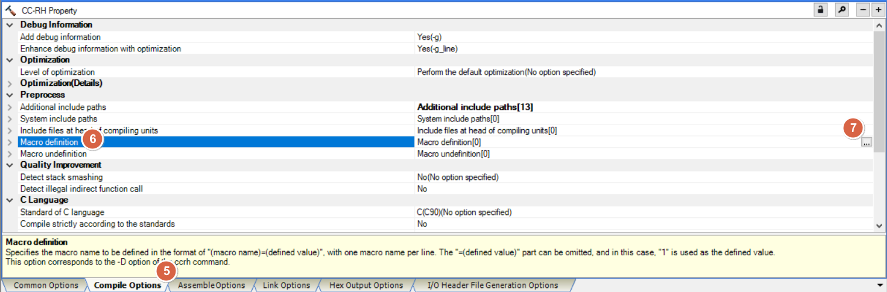

Add the macro define for extra project 
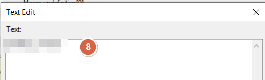

<u>CC-RH Compiler User's Manual</u>
[back to top](#article_top)    

---

